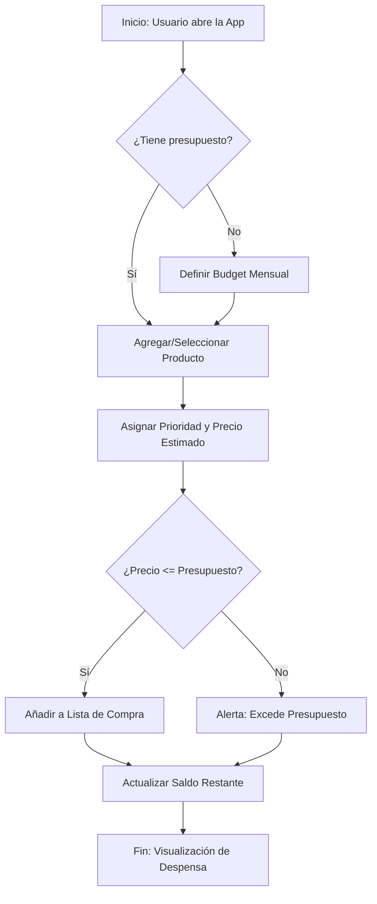

# 🛒TuDespensa 
La Solucion movil diseñada para optimizar la gestión de víveres y productos del hogar, y hacer rendir tu bolsillo y maximizar la eficiencia del gasto familiar.

## 📖 Guía de Uso (Manual de Usuario)

Para sacar el máximo provecho a **TuDespensa** y hacer rendir tu presupuesto mensual, sigue estos pasos:

### 1. Definir tu Presupuesto (Budget)
* Al iniciar el mes, dirígete a la pestaña **Presupuesto**.
* Ingresa el monto total de dinero que tienes destinado para tus compras del hogar. Este será tu límite máximo.

### 2. Organización de la Despensa
* Ve a la pestaña **Despensa**.
* Agrega los productos que necesitas comprar. 
* **Importante:** Clasifica cada producto según su prioridad:
    * 🔴 **Necesarios:** Alimentos básicos y artículos de higiene indispensables.
    * 🟠 **Básicos:** Productos que son útiles pero pueden esperar si el presupuesto es ajustado.
    * 🔵 **Opcionales/Extras:** Gustos personales o premios que solo comprarás si sobra dinero.

### 3. Registro con Cámara
* Cuando estés en el supermercado o almacén, usa el icono de la **Cámara** para registrar el producto real.
* Esto te permitirá reconocer la marca y el formato exacto en futuras compras sin tener que escribirlo de nuevo.

### 4. Control en el Punto de Venta
* A medida que agregas productos al carrito físico, verifica en la App cómo se reduce tu **Saldo Disponible**.
* Si el saldo llega a cero, la App te avisará. En ese momento, puedes decidir eliminar los productos de prioridad **Opcional** para dar espacio a los **Necesarios**.

### 5. Actualización de Precios
* Si el precio de un producto cambió desde la última vez, simplemente selecciónalo en la lista y actualiza el valor. El presupuesto se recalculará automáticamente.

## 📱Caracteristicas propias del movil 
- **Portabilidad Crítica**: Acceso instantáneo a la app.
- **Interfaz Táctil Optimizada**: Selección rápida de productos y ajuste de cantidades mediante gestos.
- **Notificaciones Locales**: Alertas o recordatorios sobre el presupuesto.
- **Modo Offline**: Capacidad de consultar y editar la lista de compras incluso en pasillos de supermercados con baja cobertura.
### 📋Requerimientos (historias de usuarios y RF/RNF)
#### RF
- El sistema debe permitir el ingreso de un presupuesto total
- El sistema debe permitir agregar, editar u eliminar cosas de la despensa
- El sistema debe calcular automaticamente el gasto proyecto vs el presupuesto real e identificar el restante
- los productos deben poder clasificarse por niveles de prioridad
#### RNF
- La aplicacion debe ser reactiva y mostrar actualizaciones en tiempo real
- los datos deben persistir en el dispocitivo (persistencia de datos)

## Diagrama de flujo del caso de uso principal

## Investigacion
### Archivo [RESEARCH](RESEARCH.md) incluyendo la informacion de investigacion.

